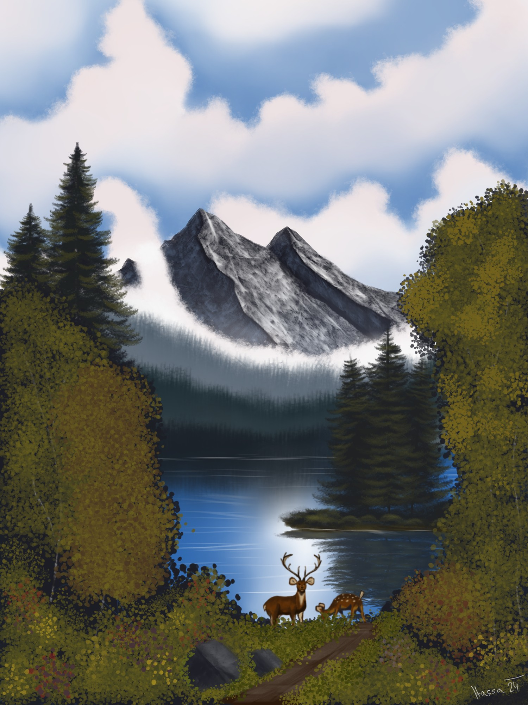
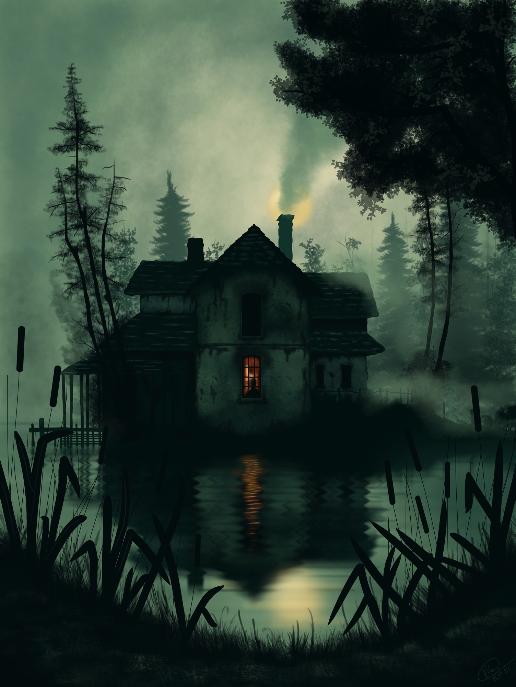
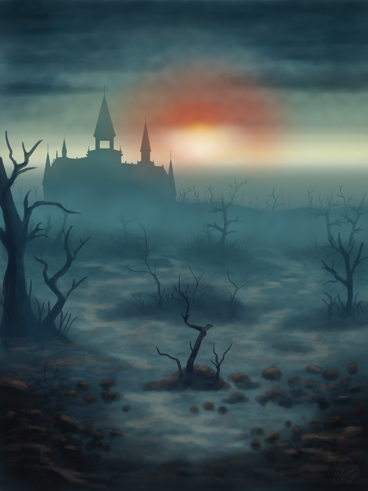
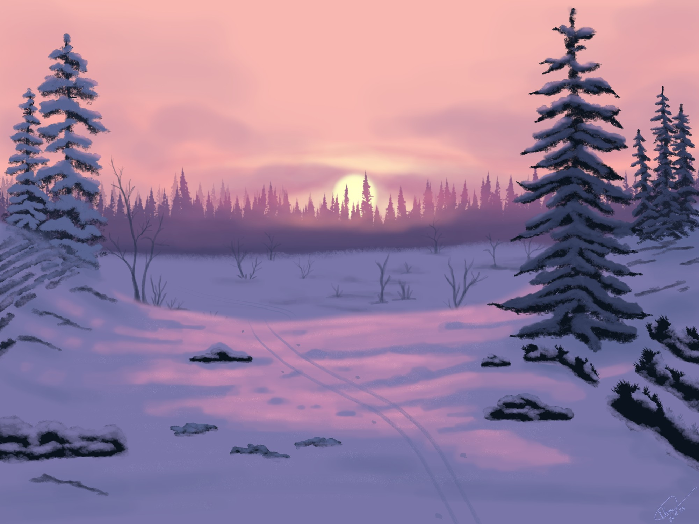
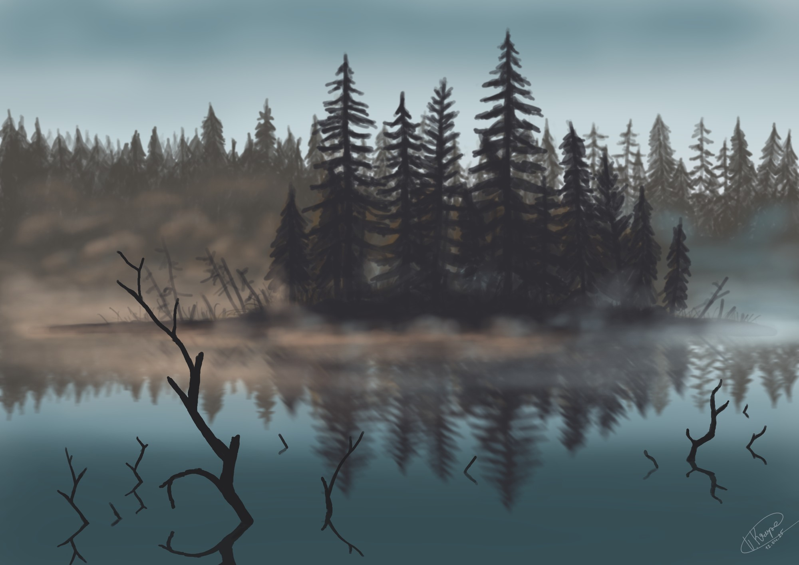
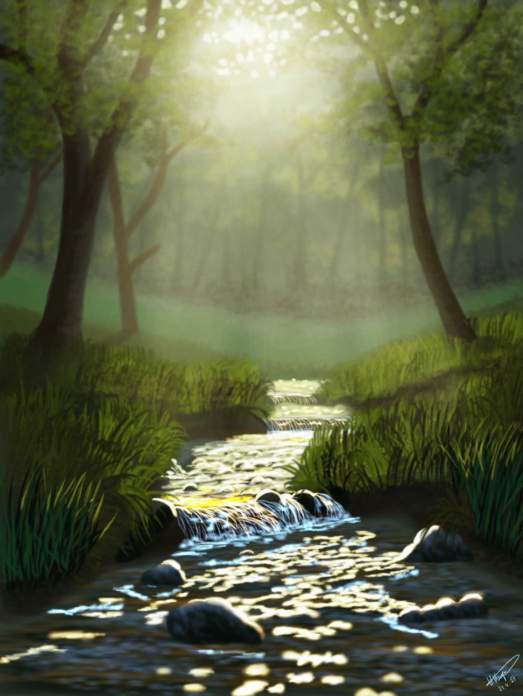
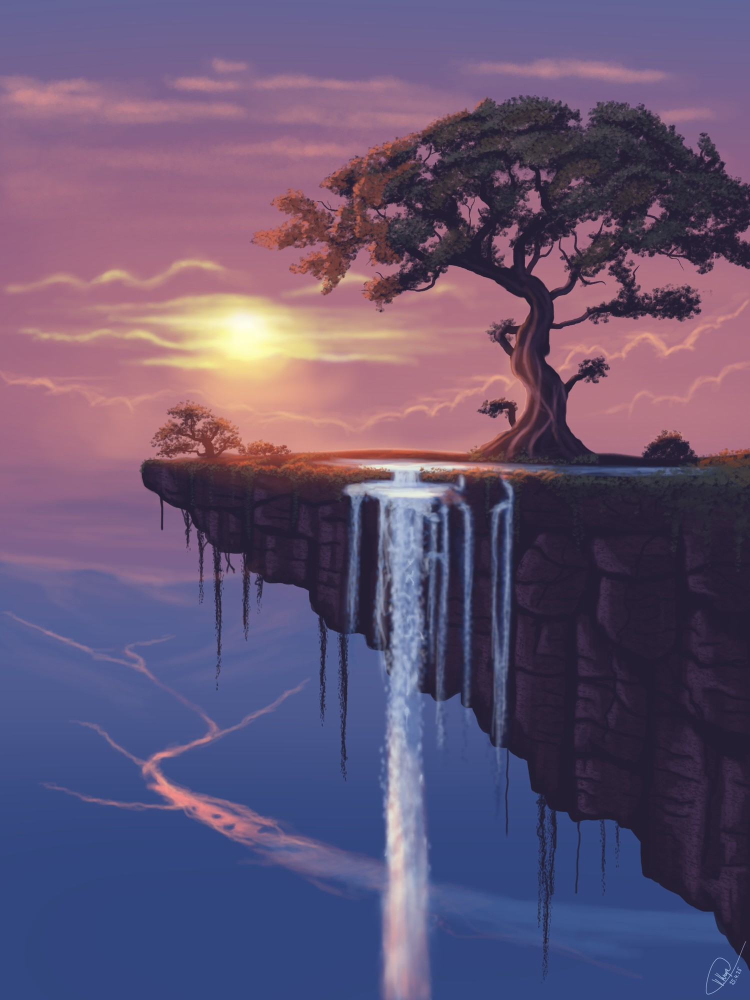

# My Art

Digital landscape paintings made in [Krita](https://krita.org) with a drawing tablet — mostly
atmospheric scenes: misty forests, mountains, sunsets, snow, and a few spooky Halloween pieces.

Everything here is a **study** painted while following along with a video tutorial (see
[Credits](#credits)). It's practice work — not commissioned, not original composition.

This repo holds web-sized previews so the work is easy to browse on GitHub. Full-resolution
exports and the layered Krita source files are attached to the
[latest release](../../releases/latest).

## Gallery

| | |
|:---:|:---:|
| <br>**Mystic Mountain** | <br>**Haunted House** |
| <br>**Spooky Castle** | <br>**Winter Landscape** |
| <br>**Trees and Misty Lake** | <br>**Spring Stream** |
| <br>**Waterfall Tree at Sunset** | |

More studies are still in progress and not shown here — *Cabin in the Woods*, *Mountain Forest
Mists*, *Traveller's Rest*, *Trees at a Water Edge*, *Woodland Stream*. Their Krita files are in
the [release](../../releases/latest) along with everything else.

## Filename key

```
2024-11-26_jj_winter_landscape_30m
└─ date    │  └─ subject          └─ ~30-minute quick study (when present)
           └─ tutorial source: br = Bob Ross, jj = James Julier
```

## Repository layout

```
images/          Web-sized JPEG previews of the finished pieces
krita/           Krita configuration
  palletes/      Custom color palettes (.kpl) built for some scenes
  krita_shortcuts.shortcuts   My keyboard shortcut set
```

Full-resolution TIFF exports and the layered `.kra` source files are **not** in Git (hundreds of
MB, and they bloat history). They're published as [release assets](../../releases/latest).

## Tools

- **Krita 5.2** — all painting
- Tablets: **Wacom Intuos S** for the earlier pieces, **XPPen Artist 12 (2nd gen)** pen display for newer work
- Custom palettes and a personal shortcut layout (both in `krita/`)

## Using the palettes

Copy the `.kpl` files from `krita/palletes/` into your Krita resource folder
(**Settings → Manage Resources → Open Resource Folder → `palettes/`**), then restart Krita.
They'll show up in the palette docker.

## Status

Ongoing — new studies get added now and then.

## Credits

Every painting here was made by following a video tutorial, as a learning exercise:

- **`jj_` — [James Julier](https://www.youtube.com/@JamesJulier-Artist).** His tutorial videos
  are published under [Creative Commons Attribution 3.0](https://creativecommons.org/licenses/by/3.0/).
- **`br_` — Bob Ross**, *The Joy of Painting*.

## License

There is no single license for this repo. It depends on the file:

| Files | Terms |
|---|---|
| Color palettes (`krita/palletes/`), shortcut config, this README | [CC0 1.0](https://creativecommons.org/publicdomain/zero/1.0/) — public domain, use freely |
| `jj_` studies | [CC BY 3.0](https://creativecommons.org/licenses/by/3.0/), following the source tutorials — reuse with credit to James Julier and a link here |
| `br_` studies | Based on copyrighted material; personal study pieces, please don't reuse commercially |

Any original paintings added in the future will be marked **© All Rights Reserved** and are not
covered by the terms above.
